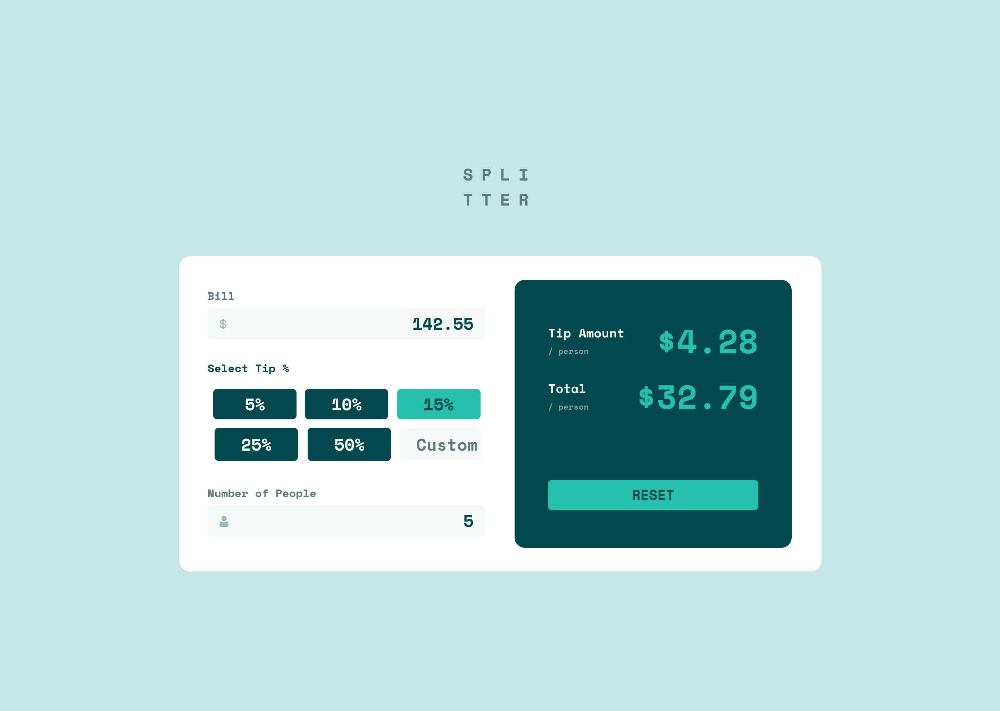

# Frontend Mentor - Tip calculator app solution

This is a solution to the [Tip calculator app challenge on Frontend Mentor](https://www.frontendmentor.io/challenges/tip-calculator-app-ugJNGbJUX). Frontend Mentor challenges help you improve your coding skills by building realistic projects.

## Table of contents

- [Overview](#overview)
  - [The challenge](#the-challenge)
  - [Screenshot](#screenshot)
  - [Links](#links)
- [My process](#my-process)
  - [Built with](#built-with)
- [Author](#author)

## Overview

### The challenge

Users should be able to:

- View the optimal layout for the app depending on their device's screen size
- See hover states for all interactive elements on the page
- Calculate the correct tip and total cost of the bill per person

### Screenshot

### Links

- Solution URL: [https://github.com/atinybeardedman/splitter](https://github.com/atinybeardedman/splitter)
- Live Site URL: [https://flamboyant-villani-d0ca47.netlify.app](https://flamboyant-villani-d0ca47.netlify.app)

## My process

I approached this app with the idea to practice using the new composition API in Vue 3 and WindiCSS (a utility framework built around tailwind's syntax). I learned a good bit about these tools as I hadn't built a full project with either of them before. I found WindiCSS's attributify mode to help with the main problem I have with Tailwind: mile long classlists that are impossible to read and tweak. Allowing the various utilities to be separated by prefix allows a much more readable markup, although I still need to work on deciding on a consistent approach regarding pseudo selectors.

I approached the site using a mobile first workflow as usual, but I attempted to design "base components" that I could use in composition to create the various components. This involved creating a BaseButton, BaseInput, and FormField component. These allowed me to them consume them to create things like a ToggleButton and inputs with validation and styling.

Overall this was an enjoyable challenge, although I continue to be a bit disappointed with the style guide provided (albeit I'm using the free version without the Figma files) as it continues to leave out colors used in the themes (such as the orange warning color and the color used on hover for the buttons). 

I also noticed in this challenge the example calculation is a bit ambiguous. When calculating the tip and the split, there is an opportunity for rounding and the example truncated rather than rounding and I rounded up. Therefore for the same input we get 1 cent difference for the tip calculation per person. Not a huge deal, but something to be aware of.

### Feedback

- I purposely chose to not use a state management library as I felt it was overkill for this app, and felt comfortable passing refs around, but I would like to know if this is considered a bad practice to get into? Should I be continuing to treat my composition functions as a central state on only allowing reading, but require a function to update them?

- I again wanted to simplify the form validation by not adding another package, but I did find my method a bit clunky (mainly due to the fact that the styles of the input are actually on a wrapper component, necessitating passing validation results back up to the parent as there's no parent selector in css). I would be interested to see if there's an easier way of doing this (without using a third party validation library)

### Built with

- Vue 3 (Composition API)
- WindiCSS
- Flexbox
- Mobile First Workflow

## Author

- Website - [Sean Dickinson](https://seandickinson.dev)
- Frontend Mentor - [@atinybeardedman](https://www.frontendmentor.io/profile/atinybeardedman)
